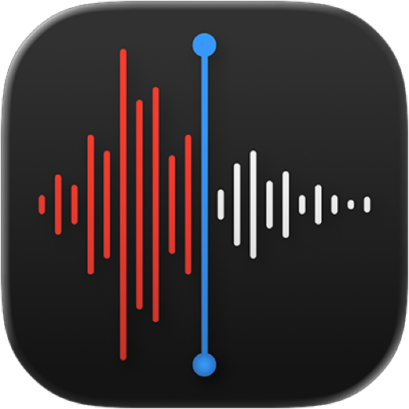

<p align="center">
  
</p>

# apple-voicememos-mcp

A local MCP server, written in Swift, exposing macOS **Voice Memos** to Claude: list
recordings, read their metadata, transcribe them on-device with Apple's `Speech`
framework, and export a copy of the audio. It ships as a Claude extension.

Voice Memos has no scripting dictionary and no framework — it is one of the few Apple
apps with neither. So recordings are reached as files on disk rather than through an
API, and there is no network and no cloud transcription anywhere in this server.

Not affiliated with or endorsed by Apple Inc.

## Requirements

- macOS 15 or later
- Swift 6.0 or later (Xcode 26 ships it)
- A code signing identity. Ad-hoc works, but every rebuild then asks for permission
  again — see [Signing](#signing-and-why-it-is-not-optional).

## Tools

| Tool | Kind | What it does |
|---|---|---|
| `recordings_status` | read | Reports which recording library this server can reach, whether Speech Recognition is granted, whether the on-device model for the recognition locale is installed, and where exports and cached transcripts go. Reads no audio. |
| `recordings_list` | read | Recordings with id, name, date, duration and folder, newest first. Says how many matches were withheld. |
| `recording_get` | read | Full record for one or more ids: name, file name, full path, folder, dates, duration, size and file type. No audio, no transcript. |
| `recording_transcribe` | read | Transcribes recordings to text with `Speech`, forced to on-device recognition. Slow — see below. |
| `recording_export` | write | Copies a recording's audio into the configured export folder. The original is never moved, renamed or touched. |

## The rules worth knowing before you use it

**Nothing here can rename, move or delete a recording.** There is no such tool, on
purpose — this server reads and transcribes a library, it does not manage one. A test
walks the whole catalogue to keep it that way.

**Transcription is forced on-device and that is not configurable.** `recording_transcribe`
sets `requiresOnDeviceRecognition` on every request; the audio never leaves the Mac and
no network request is made. That is the whole reason transcribing someone's private
recordings is acceptable at all, so it is not exposed as a flag to turn off.

**Transcription is slow.** On-device recognition runs at roughly the length of the
audio itself, and nothing is reported until the whole batch finishes. A call is capped
at `maximumTranscribeCount` recordings (5 by default, configurable 1–25) for exactly
that reason — ask for the recordings actually needed rather than sweeping a listing.
A second call for the same recording is immediate: transcripts are cached under
`$TMPDIR`, keyed by a hash of the recording's id.

**There is no search over spoken words.** Finding a phrase means transcribing the
candidate recordings and reading them; the server will not silently transcribe a whole
library to answer a question.

**`recording_export` writes only inside the configured export root**, and refuses
everywhere else — a destination cannot climb out of it with `../`, and an existing file
is never overwritten. With no export root configured, every export is refused.

**A recording's name comes from its audio metadata, not its file name.** Voice Memos
names files by timestamp and keeps the title you typed in its own database, but also
writes that title into the audio's common metadata — reading it back is the difference
between a listing of dates and a listing of subjects. The file name is the fallback
when no title was written.

**The `folder` filter is not a Voice Memos in-app folder.** Voice Memos keeps its
in-app folders in its own database, not on disk, which this server never reads. `folder`
here means the sub-folder path under whichever library root it is reading from, and
reads as `(root)` for a library with none.

**A plain day given as `created_before` covers that whole day.** Read literally it
would exclude the day named, which would make a one-day window always empty; a test
pins the inclusive behaviour.

## Install

### 1. Build the bundle

```bash
MCPB_SIGN_IDENTITY="Apple Development: Your Name (TEAMID)" ./scripts/pack.sh
```

That builds a universal (arm64 + x86_64) release binary, signs it, checks the embedded
`Info.plist` survived both linking and signing, prints the designated requirement, and
writes `dist/apple-voicememos-mcp.mcpb`. It fails loudly rather than shipping a bundle
that would silently refuse to work — including checking that `NAME=` at the top of the
script actually says `apple-voicememos-mcp`, since this script was copied from the
calendar server and once packed the wrong binary while reporting success.

```bash
security find-identity -v -p codesigning
```

### 2. Install it

Open `dist/apple-voicememos-mcp.mcpb` with Claude. Then **quit Claude Desktop completely
and reopen it** — reinstalling does not replace a server process that is already
running, and the old one keeps answering.

### 3. Reach the recordings

Unlike the EventKit-backed servers (Calendar, Reminders), there is no framework
permission that unlocks Voice Memos directly. `recordings_status` reports which of two
situations the server is in, rather than returning an empty list — an empty library and
an unreadable one must never look the same:

- **Full Disk Access** to the Voice Memos sandbox container. It has no consent dialog
  and no Info.plist key — it is granted entirely by hand, at System Settings → Privacy
  & Security → Full Disk Access → **+** → add the installed server binary, then restart
  Claude Desktop.
- **An ordinary folder of audio files**, nominated instead of the real library. The
  server's own error text (and `recordings_status`) point at a "Recording library
  folder" setting in Claude Desktop → Settings → Extensions — but as currently packed,
  `extension/manifest.json` declares no `user_config`, so that setting does not actually
  exist in the installed extension yet. See [Known limits](#known-limits).

### 4. Grant Speech Recognition

The first call to `recording_transcribe` raises the Speech Recognition dialog. The
grant appears under System Settings → Privacy & Security → Speech Recognition, labelled
with the binary's `CFBundleName`, `apple-voicememos-mcp`
(Spanish UI: Ajustes del Sistema → Privacidad y seguridad → Reconocimiento de voz).

The binary is **its own privacy subject**: Claude Desktop launches MCP servers through
`Contents/Helpers/disclaimer`, which calls `responsibility_spawnattrs_setdisclaim`, so
the child cannot inherit the host app's permissions. Hence the `Info.plist` embedded at
link time, carrying `NSSpeechRecognitionUsageDescription`.

If no dialog ever appears:

```bash
otool -P extension/server/apple-voicememos-mcp | grep NSSpeechRecognitionUsageDescription
```

### Signing, and why it is not optional

`swift build` leaves a signature the linker generated, flagged `linker-signed`. macOS
treats that as signed by nobody: it produces **no designated requirement**, so there is
nothing to anchor a permission to except the binary's cdhash — and every rebuild
changes that. Worse, a linker-signed binary never gets a consent dialog at all; the
request returns with the status still "not determined".

Signing with a real certificate produces a requirement anchored to the bundle
identifier and the certificate instead:

```
designated => identifier "codes.eneko.apple-voicememos-mcp" and anchor apple generic
              and certificate leaf[subject.CN] = "Apple Development: …"
```

That survives rebuilds. `pack.sh` prints the requirement on every build, so a silent
regression to ad-hoc is visible immediately. Rebuilding under a fresh cdhash still costs
one fresh consent round if the *identity* itself changes.

### Preparing something to distribute

```bash
MCPB_HARDENED=1 MCPB_SIGN_IDENTITY="Developer ID Application: …" ./scripts/pack.sh
```

That adds the hardened runtime and a secure timestamp, which notarisation requires.
`NSAppleEventsUsageDescription` is embedded and, if `Resources/entitlements.plist`
exists, applied — declared for a possible future Shortcuts route to the in-app folder a
recording belongs to, though nothing in this server sends an Apple event today.

## Tool switches

Every tool can be turned on and off individually in Claude Desktop → Settings →
Extensions, because the bundle declares all five in its manifest. Turning off
`recording_export` leaves a server that can only read and transcribe.

**Reinstalling may reset the switches.** Check them after every install.

## Manual registration instead

```json
{
  "mcpServers": {
    "Apple Voice Memos": {
      "command": "/absolute/path/to/apple-voicememos-mcp/.build/release/apple-voicememos-mcp"
    }
  }
}
```

You lose the per-tool switches. This is also, currently, the only way to reach the
`--library`, `--export-root`, `--locale`, `--list-limit` and `--max-transcribe` flags
`Configuration.parse` understands, since the packaged extension does not yet expose
them — add an `"args"` array alongside `"command"` to pass any of them:

```json
"args": ["--export-root", "/absolute/path/to/a/scratch/folder"]
```

Do not run both at once: two registrations under the same display name collide, and
`recordings_status` prints the binary path precisely so you can tell which one
answered.

## Known limits

- **The extension's own settings pane has nothing in it yet.** `Configuration` supports
  a nominated library folder, an export root, a recognition locale, a list page size and
  a transcribe-batch cap, all read from command-line flags — the mechanism a Claude
  extension normally uses to fill in via `user_config` substituted into
  `mcp_config.args`. `extension/manifest.json` wires up none of it: `args` is empty and
  there is no `user_config` block. So as installed from the `.mcpb`, `recording_export`
  is always refused (no export root is ever configured) and the library is always read
  from Full Disk Access or the two default Voice Memos paths — never a nominated folder.
  The flags work; only manual registration (above) can currently reach them.
- **No search over spoken words.** A phrase inside a recording can only be found by
  transcribing candidates and reading the text back.
- **Transcription is capped and slow**, by design — see
  [the rules above](#the-rules-worth-knowing-before-you-use-it).
- **Nothing manages the library.** No rename, delete, move or re-record tool exists,
  and none is planned; `recording_export` writes a copy, it never touches the original.
- **`NSAppleEventsUsageDescription` is declared but unused.** It is there for a possible
  future Shortcuts route to the in-app folder a recording belongs to (the filesystem
  cannot see it), but no tool sends an Apple event today.

## Development

```bash
swift build
swift test
```

43 tests, all against an in-memory fake (`FakeRecordingStore`) with invented recording
names, durations and transcripts. They need no permissions and never touch a real
recording — see `CLAUDE.md`, whose first section is the hard rule that makes that
non-negotiable: an agent must never transcribe, export, modify or delete a real
recording, and it may exercise the `Speech` path only against synthetic audio it
generated itself, in a temporary directory, deleted in the same session.

Manual verification against a live library is the owner's job; `verification.md` is
the script for it.

## Licence

MIT.
